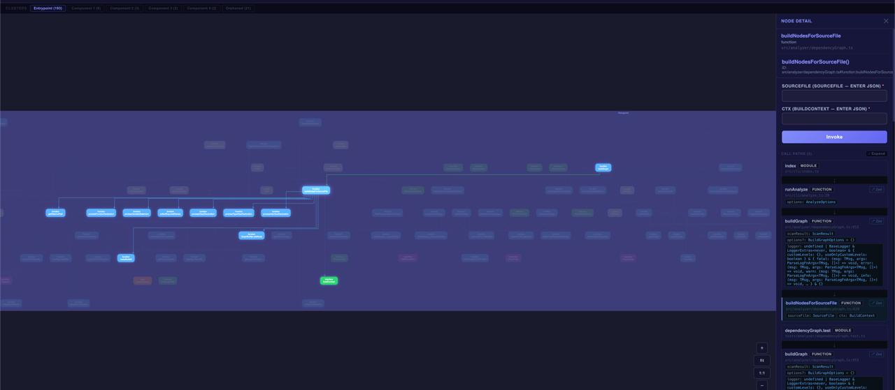
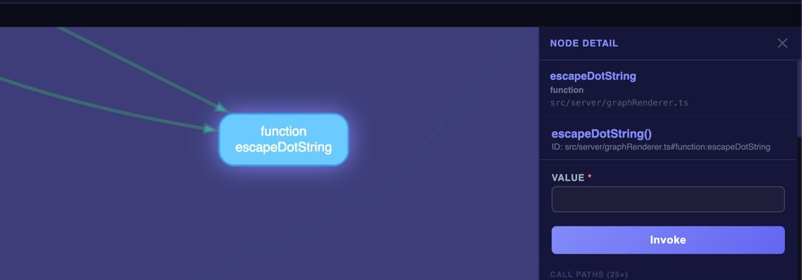
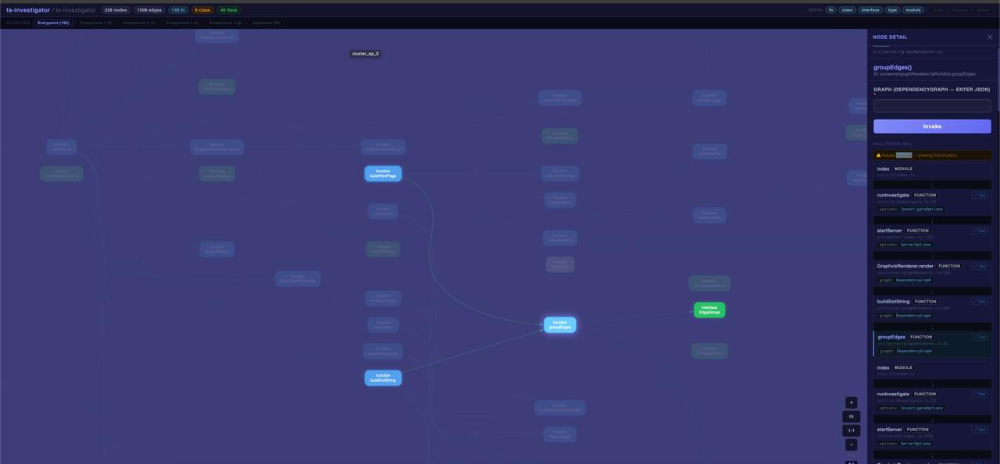
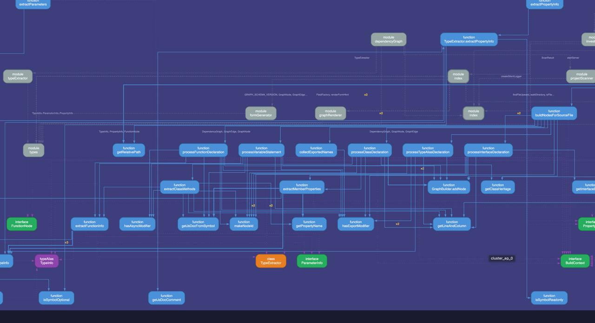

# ts-investigator

A CLI tool that statically analyzes TypeScript projects, builds a dependency graph, and provides an interactive web-based UI for exploring your codebase.

## Demo

https://github.com/user-attachments/assets/demo.mp4

> *Full walkthrough of ts-investigator analyzing its own codebase*

## Screenshots

### Full Dependency Graph with Node Detail Panel



The main investigation view renders your entire project as an interactive dependency graph. Click any node to open the detail panel on the right, which shows the function's full signature, parameter types, and an auto-generated invocation form.

### Node Detail Close-Up



Each function node shows its source location, full ID, and a dynamically generated form based on its TypeScript parameter types — including support for unions, optional fields, and nested objects.

### Component View



The component view groups related nodes into connected subgraphs. The toolbar shows project-wide statistics including node count, edge count, and breakdowns by type (functions, classes, interfaces, type aliases, modules).

### Dependency Overview



A zoomed-out view of the complete dependency graph with nodes color-coded by kind: functions (blue), modules (green), classes (red), interfaces (orange), and type aliases (pink). Edge labels show which symbols flow between modules.

## Features

- **Full project indexing** — Uses the TypeScript compiler API to scan all source files via `tsconfig.json`
- **Dependency graph generation** — Maps call relationships, import chains, inheritance, and type references across your entire codebase
- **Interactive web UI** — Graphviz-rendered SVG visualization with pan, zoom, click-to-inspect, and component filtering
- **Auto-generated parameter forms** — Click any function to get a form with fields derived from its TypeScript parameter types
- **Architecture analysis** — Detects dead code, circular dependencies, god functions, duplicate signatures, and module coupling issues
- **LLM-ready output** — Generates structured Markdown prompts for AI-assisted refactoring recommendations

## Installation

```bash
npm install -g ts-investigator
```

Requires Node.js >= 18 and TypeScript >= 4.7 as a peer dependency.

## Usage

ts-investigator has three commands:

### `analyze` — Index your project

```bash
ts-investigator analyze --project ./tsconfig.json
```

Scans your TypeScript project and writes the dependency graph to `tsinvestigator-graph.json`.

### `investigate` — Explore interactively

```bash
ts-investigator investigate
```

Starts a local web server and opens the interactive graph visualization in your browser.

### `architect` — Get refactoring insights

```bash
ts-investigator architect
```

Analyzes the dependency graph for code quality issues and outputs structured recommendations covering dead code, circular dependencies, coupling metrics, and more.

## License

[AGPL-3.0](LICENSE)
